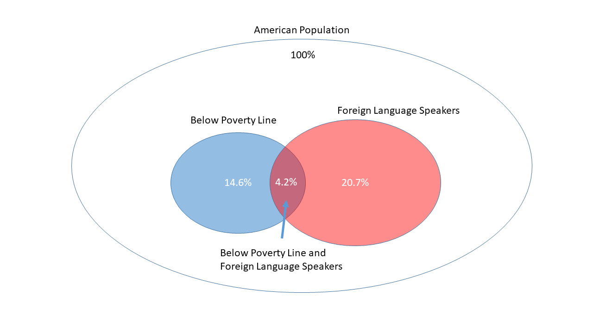
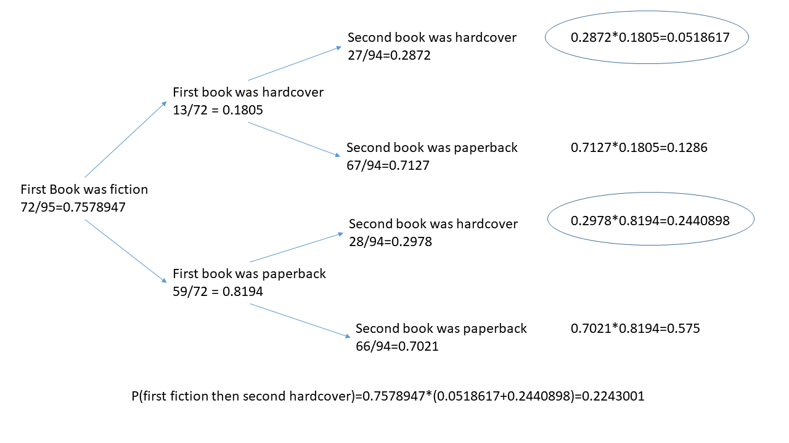

```{r setup, include=FALSE}
knitr::opts_chunk$set(echo = TRUE)
```

#Homework 2
##Probability

#2.6
Dice rolls. If you roll a pair of fair dice, what is the probability of

(a) getting a sum of 1? 

Probablility of getting a sum of 1 is zero. The minimum sum possible is 2 since each dice has a smallest face value of 1 and both dice are rolled. We would have to roll only one dice, in which case the probablisity of a 1 would be 1/6


(b) getting a sum of 5?

Since the probabilities of rolling a given number on each dice are disjoint, we can add up the probabilities. The probability of each die face is 1/6.    

P(sum=5) = P(1 and 4) or P(2 and 3) or P(3 and 2) or P(4 and 1)   
P(sum=5) = 1/6*1/6 + 1/6*1/6 + 1/6*1/6 + 1/6*1/6    
P(sum=5) = 4 * 1/36 = 4/36 = 0.1111111    

We can d this manually since the possible outcomes are rather limited. But if we had say 3 or more dice, then calculating manually might be a complicated undertaking. We can also run a simulation and calculate the probability from the resulting histogram.

```{r}
#we define two dice
d1<-c(1,2,3,4,5,6)
d2<-c(1,2,3,4,5,6)
#we simulate rolling the dice 5000 times
#we could have simply used one die, but if we use two we could make them both unfair dice in different ways. Here we leaft both as fair, i.e. both have a probability 1/6 per die face 
diceRoll<-vector()
for (i in 0:5000) {
  diceRoll<-c(diceRoll,sample(d1,1)+sample(d2,1))
}
#a histogram is created out of the simulation
h<-hist(diceRoll,plot = FALSE,breaks=c(1,2,3,4,5,6,7,8,9,10,11,12,13))
#we change the counts in the histogram to probabilities which gives us a probability distribution
h$counts<-h$counts/sum(h$counts)
plot(h)
h
# Since this is a distribution of probabilities, the sum of each disjoint should be equal to 1
sum(h$counts)
```

Probability of sum = 5 is given in h$density[4]

```{r}
h$density[4]
```


(c) getting a sum of 12?

Same as before, but here we have only one possible outcome of the dice roll:

P(sum=12)=P(6 and 6)
P(sum=12)=1/6*1/6
P(sum=12)=1/36=0.02777778

We can re-sun the simulation as before.

```{r}
diceRoll<-vector()
for (i in 0:5000) {
  diceRoll<-c(diceRoll,sample(d1,1)+sample(d2,1))
}
h<-hist(diceRoll,plot = FALSE,breaks=c(1,2,3,4,5,6,7,8,9,10,11,12,13))
h$counts<-h$counts/sum(h$counts)
plot(h)
```

P(sum=12) will be in h$density[11]

```{r}
h$density[11]
```


#2.8
Poverty and language. The American Community Survey is an ongoing survey that provides data every year to give communities the current information they need to plan investments and services. The 2010 American Community Survey estimates that 14.6% of Americans live below the poverty line, 20.7% speak a language other than English (foreign language) at home, and 4.2% fall into both categories.

(a) Are living below the poverty line and speaking a foreign language at home disjoint?   
No since living below the poverty line could include or not include foreign language speakers. The cases states that 4.2% actually fall in both categories.

(b) Draw a Venn diagram summarizing the variables and their associated probabilities.    


(c) What percent of Americans live below the poverty line and only speak English at home?     

Below Poverty Line and Speak English = Below Poverty Line - Speak Foreign Language
Below Poverty Line and Speak English = 14.6% - 4.2% = 10.4%   

(d) What percent of Americans live below the poverty line or speak a foreign language at home?     

Below Poverty Line or Speack Foreign Language = Below Property Line + Foreign Language Speaker - Below Property Line and Foreign Languge Speaker  
Below Poverty Line or Speak Foreign Language = 14.6% + 20.7% - 4.2%    
Below Poverty Line or Speak Foreign Language = 31.1%   

(e) What percent of Americans live above the poverty line and only speak English at home?     

Above Poverty Line and Speak English = 100% - Below Poverty Line or Speack Foreign Language   
Above Poverty Line and Speak English = 100% - 31.1% = 68.9%

(f) Is the event that someone lives below the poverty line independent of the event that the person speaks a foreign language at home?

Yes, if someone lives below the poverty line does not mean that person speakes a foreign language or not. We find cases in which they do, 4.2%, and don't 10.4%.

#2.20
Assortative mating is a nonrandom mating pattern where individuals with similar genotypes and/or phenotypes mate with one another more frequently than what would be expected under a random mating pattern. Researchers studying this topic collected data on eye colors of 204 Scandinavian men and their female partners. The table below summarizes the results. For simplicity, we only include heterosexual relationships in this exercise.


To answer questions in this case, we compute the table proportions from the contingency table given. We do this by dividing each count by the table total, 204.

```{r}
#We compute the Totalsinstead of copying them just as a sanity check
contTable<-matrix(c(78,23,13,19,23,12,11,9,16),byrow = TRUE,ncol = 3)
contTable<-cbind(contTable,c(sum(contTable[1,]),sum(contTable[2,]),sum(contTable[3,])))
contTable<-rbind(contTable,c(sum(contTable[,1]),sum(contTable[,2]),sum(contTable[,3]),sum(contTable[,4])))
colnames(contTable)<-c("Blue","Brown","Green","Total")
rownames(contTable)<-c("Blue","Brown","Green","Total")
contTable

propTable<-contTable/contTable[4,4]
propTable
```


(a) What is the probability that a randomly chosen male respondent or his partner has blue eyes?  

P(blue eye)

```{r}
#using the Contingency Table
contTable[1,4]/contTable[4,4]

#using the Proportions Table
propTable[1,4]
```

P(partner blue)

```{r}
#using the Contingency Table
contTable[4,1]/contTable[4,4]

#using the Proportions Table
propTable[4,1]
```

The probability of a male respondent having blue eyes or the partner having blue eyes can be calculated by: P(male blue) + P(partner blue) - P(male and partner blue)

```{r}
#P(male and partner blue)
#using the Proportions Table
propTable[1,4]+propTable[4,1]-propTable[1,1]
```


(b) What is the probability that a randomly chosen male respondent with blue eyes has a partner with blue eyes?      

P(partner blue eye | male blue eye) = P(partner blue eye and male blue eye) / P(male blue eye)

```{r}
#using the Contingency Table
(contTable[1,1]/contTable[4,4])/(contTable[1,4]/contTable[4,4])

#using the Proportions Table
propTable[1,1]/propTable[1,4]
```


(c) What is the probability that a randomly chosen male respondent with brown eyes has a partner with blue eyes? What about the probability of a randomly chosen male respondent with green eyes having a partner with blue eyes? 

P(partner blue | brown eye) = P(partner blue and brown eye) / P(brown eye)

```{r}
#using the Contingency Table
contTable[2,1]/contTable[2,4]

#using the Proportions Table
propTable[2,1]/propTable[2,4]
```

P(partner blue | green eyes) = P(partner blue and green eye) / P(green eye)

```{r}
#using the Contingency Table
contTable[3,1]/contTable[3,4]

#using the Proportions Table
propTable[3,1]/propTable[3,4]
```

(d) Does it appear that the eye colors of male respondents and their partners are independent? Explain your reasoning.

There seems to be some dependancy, from the data it seems males and partners tend to get together with same color eyes. We can see this in both tables, for each color eye row, we get the highest value for the columns corrsponding to the same eye color. But to also to keep in mind, this is an observational study, not an experiment, so extrapolating results might not be possible.

```{r}
#The maximum column is the same as the row number for each row
which.max(contTable[1,1:3]) #Blue Eye
which.max(contTable[2,1:3]) #Brown Eye
which.max(contTable[3,1:3]) #Green Eye
which.max(propTable[1,1:3]) #Blue Eye
which.max(propTable[2,1:3]) #Brown Eye
which.max(propTable[3,1:3]) #Green Eye
```


#2.30
Books on a bookshelf. The table below shows the distribution of books on a bookcase based on whether they are non-fiction or fiction and hardcover or paperback.


(a) Find the probability of drawing a hardcover book first then a paperback fiction book second when drawing without replacement. 

P(hardcover first) = 28/95 = 0.2947368         

P(paperback and fiction second) = 59/94 = 0.6276596       

P(hardcover first then paperback second) = 0.2947368 * 0.6276596 = 0.1849944        


(b) Determine the probability of drawing a ???ction book first and then a hardcover book second, when drawing without replacement.  

P(fiction first) = 72/95 = 0.7578947     

For the second draw we have two cases. One if the first fiction book was a hardcover, and second if the first fiction book was a paperback

P(hardcover second without replacement given that the first fiction was hardcover) = 27/94 = 0.287234    
P(hardcover second without replacementgiven that the first fiction was a paperback) = 28/94 = 0.2978723 

To calculate the desired conbined probability we multiply each case by the probability of it happening. This is the marginal probability for hardcover (13/72) and paperback (59/72) knowing we the book drawn was fiction:

P(hardcover and first fiction was hardcover) = (27/94)*(13/72) = 0.0518617
P(hardcover and first fiction was paperback) = (28/94)*(59/72) = 0.2440898

We add these two probabilities since we want one event or the other and they are independent:
P(hardcover and first fiction was hardcover or hardcover and first fiction was paperback) = 0.0518617 + 0.2440898 = 0.2959515

Now we multiply the results by the probability of the first book being finction:
P(First fiction and second hardcover) = 0.7578947 * 0.2959515 = 0.2243001
 

We can also use a tree to calculate all the probabilities



(c) Calculate the probability of the scenario in part (b), except this time complete the calculations under the scenario where the first book is placed back on the bookcase before randomly drawing the second book.    

P(fiction first) = 72/95 = 0.7578947         

P(hardcover second with replacement) = 28/95 = 0.2947368      

P(fiction first and hardcover second with replacement) = P(fiction first) * P(hardcover second with replacement)       
P(fiction first and hardcover second with replacement) = 0.7578947 * 0.2947368 = 0.2233795

P(hardcover second | finction first) = P(hardcover) because we replaced the first book, so both first and second draw are independent. What was drawn on the first does not affect the second.    

(d) The final answers to parts (b) and (c) are very similar. Explain why this is the case.

Answer are very similar because the number of books is large enough that drawing one from the overall makes little difference. So replacing the book or not changes the total number of books very little, making these probabilities very smilar.

#2.38
Baggage fees. An airline charges the following baggage fees: $25 for the ???rst bag and $35 for the second. Suppose 54% of passengers have no checked luggage, 34% have one piece of checked luggage and 12% have two pieces. We suppose a negligible portion of people check more than two bags.   

(a) Build a probability model, compute the average revenue per passenger, and compute the corresponding standard deviation.   


```{r}
fees<-c(0,25,35+25)
prob<-c(0.54,0.34,0.12)
df<-data.frame(fees,prob)
df$feeXprob<-df$fee*df$prob
EV<-sum(df$feeXprob)
df$xmu<-df$fees-EV
df$sqrxmu<-(df$xmu)^2
df$sqrxmuXprob<-df$sqrxmu*df$prob
df
variance=sum(df$sqrxmuXprob)
standardDev=sqrt(variance)

#results

#Average revenue per passenger
EV

#Standard deviation
standardDev
```

(b) About how much revenue should the airline expect for a ???ight of 120 passengers? With what standard deviation? Note any assumptions you make and if you think they are justi???ed.

Assuming the revenues per each passenger is an independant event, that is one passenger won't take more or less bag given the amount of bags other passenger take.

```{r}
#Expected reveneu for 120 passengers
EV120<-EV*120
EV120
#variance of 120 passenegrs
var120<-120^2*variance
var120
#STandard deviation is the square root of variance
sd120<-sqrt(var120)
sd120
```


#2.44
Income and gender. The relative frequency table below displays the distribution of annual total personal income (in 2009 in???ation-adjusted dollars) for a representative sample of 96,420,486 Americans. These data come from the American Community Survey for 2005-2009. This sample is comprised of 59% males and 41% females.    


(a) Describe the distribution of total personal income.     

Looking at the distribution below we can see how it is slightly bimodal, with a peak at an income of $35-$49.999 and another smaller one for incomes greater than $100k 

```{r}
income <- c("$1 - $9,999 or loss", 
            "$10,000 to $14,999", 
            "$15,000 to $24,999",
            "$25,000 to $34,999",
            "$35,000 to $49,999",
            "$50,000 to $64,000",
            "$65,000 to $74,999",
            "$75,000 to $99,999",
            "$100,000 or more")
total <- c(0.022, 0.047, 0.158, 0.183, 0.212, 0.139, 0.058, 0.084, 0.097)
df<- data.frame(income, total)
df
op <- par(mar=c(11,4,4,2))
rm(op)
barplot(df$total,main='American Community Survey for 2005-2009',names.arg = df$income,las=3)
```

(b) What is the probability that a randomly chosen US resident makes less than $50,000 per year?      

```{r}
sum(df$total[1:5])
```


(c) What is the probability that a randomly chosen US resident makes less than$50,000 per year and is female? Note any assumptions you make.     

We are told the sample contains 59% males and 41% females. If we assume this split is the same for all income groups, that is, in each bin we have 59% males and 41% females, then the desired probability is:

```{r}
sum(df$total[1:5])*0.41
```


(d) The same data source indicates that 71.8% of females make less than $50,000 per year. Use this value to determine whether or not the assumption you made in part (c) is valid.

The assumtion made in c) is not valid since here the split of males and females is not the same for all income groups. 

```{r}
sample<-96420486
malesFemalesUnder50k<-sample*sum(df$total[1:5])
malesFemalesUnder50k

#in C) 41% of these are females
malesFemalesUnder50k*.41

#in d) however 71.8% of females are under $50k, so here the total females with income less than $50k is not the same number as in c)
totalFemales<-sample*.41
totalMales<-sample*.59
femalesUnder50k<-totalFemales*.71
femalesUnder50k

# from which we can back calculate total males and females under $50k as a check
malesUnder50k<-malesFemalesUnder50k-femalesUnder50k
femalesUnder50k+malesUnder50k
```

